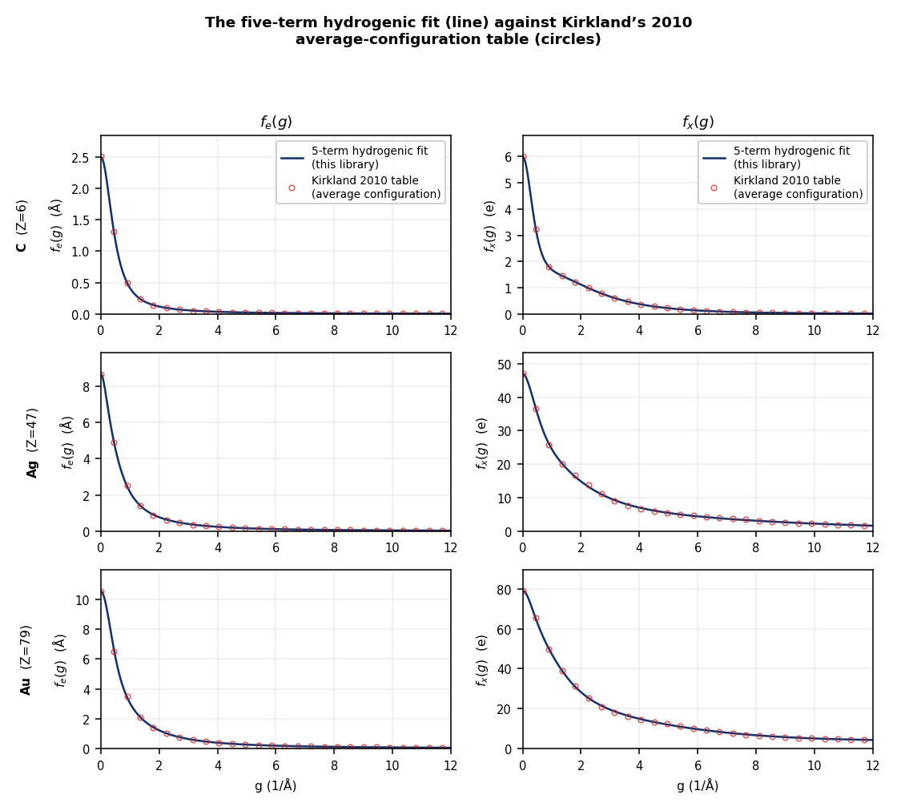
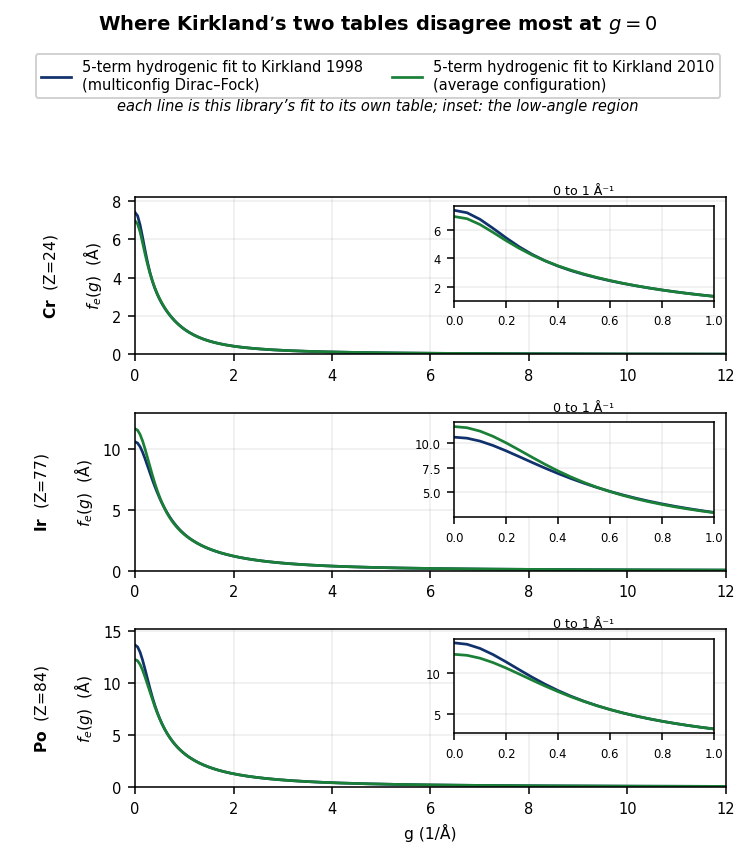

# hydrogenic_scattering_factor_2014

<!-- readme-archetype: library -->

## Project information

Developed by Ivan Lobato / [NeuralSoftX](https://neuralsoftx.com/).
Contact: `ivan.lobato@neuralsoftx.com`.
Licence: `Apache-2.0`.
Canonical repository: [NeuralSoftX/hydrogenic_scattering_factor_2014](https://github.com/NeuralSoftX/hydrogenic_scattering_factor_2014).

## Overview

The published five-term hydrogenic parameterisation of electron and X-ray
scattering factors, electron densities and electrostatic potentials for the neutral
atoms `Z = 1`–`103`, released together with the numerical tables it was fitted to
and a second coefficient set for the same parameterisation refitted against a second
set of those tables.

> **I. Lobato and D. Van Dyck**, *An accurate parameterization for scattering
> factors, electron densities and electrostatic potentials for neutral atoms that
> obey all physical constraints*, Acta Cryst. A **70**, 636–649 (2014).
> doi: [10.1107/S205327331401643X](https://doi.org/10.1107/S205327331401643X)

[](LICENSE)


### Theory, briefly

The basis is the non-relativistic electron scattering factor of hydrogen, with a
fixed `n_t = 5` terms per element. Each term carries an amplitude `a_i` (Å) and a
width `b_i` (Ų), and because every term is a hydrogenic 1s shape, the fit yields
closed forms for `f_e(g)`, `f_x(g)`, the electron density `ρ(r)` and the
electrostatic potentials `V(r)` and `V(R)` from the *same* coefficients. The
hydrogen form is preferred to independent sums of Lorentzians and squared
Lorentzians because it gives the correct `1/g²` decay by construction and
guarantees an integrable density with no singularity.

The fit is a two-level optimisation: simulated annealing over the nonlinear widths
`{b_i}`, with the amplitudes `{a_i}` solved at each trial by linear least squares
through a singular value decomposition. Three constraints are imposed analytically
rather than left to the fit — the tabulated `f_e(0)`, charge neutrality, and Kato's
cusp condition — which is what makes the published coefficients obey the physical
limits rather than merely approximate the table.

### Formulas

With the derived quantities

```math
b'_i = \frac{2\pi}{\sqrt{b_i}}, \quad
\tilde a_i = \frac{2\pi^2 a_0\, a_i}{b_i}, \quad
\hat a_i = \frac{2\pi^4 a_0\, a_i}{b_i^{5/2}}, \quad
a'_i = \frac{\pi^2 a_i}{\kappa\, b_i^{3/2}}, \quad
a''_i = 2 a'_i
```

and $a_0 = 0.52917721077817892$ Å,
$\kappa = 4\pi\varepsilon_0/(2\pi a_0 e)$, $1/\kappa = 47.877642131544313031$, the
quantities are

```math
f_e(g) = \sum_{i=1}^{n_t} a_i\, \frac{2 + b_i g^2}{(1 + b_i g^2)^2}
```

```math
f_x(g) = \sum_{i=1}^{n_t} \frac{\tilde a_i}{(1 + b_i g^2)^2}, \qquad f_x(0) = Z
```

```math
\rho(r) = \sum_{i=1}^{n_t} \hat a_i\, e^{-b'_i r}
```

```math
V(r) = \sum_{i=1}^{n_t} a'_i\, e^{-b'_i r}\!\left(\frac{2}{b'_i r} + 1\right)
```

```math
V(R) = \sum_{i=1}^{n_t} a''_i \left(\frac{2 K_0(b'_i R)}{b'_i} + R\, K_1(b'_i R)\right)
```

$K_0$ and $K_1$ are modified Bessel functions of the second kind; $V(R)$ is the
projected (integrated-along-the-beam) potential.

The published coefficients satisfy, by construction (the first is equivalently
$f_x(0) = Z$; the second is Ibers' relation):

```math
\begin{aligned}
\sum_{i=1}^{n_t} \frac{a_i}{b_i} &= \frac{Z}{2\pi^2 a_0}, \\
\sum_{i=1}^{n_t} 2 a_i &= f_e(0), \\
\left.\frac{\partial \rho(r)}{\partial r}\right|_{r=0} &= -\frac{2Z}{a_0}\,\rho(0)
\end{aligned}
```

The third is Kato's cusp condition. All three hold to machine precision for
`kirkland_multiconfig_dirac_fock_1998`; the 2010 refit satisfies the first two only
to about `1e-7` relative and does not impose the cusp.

> The individual $a_i$ are signed expansion coefficients, **not** physical shell
> charges. The exact constraints apply to the summed quantities.

The 2014 paper fitted this form to Kirkland's 1998 table. The library also carries
a second coefficient set in which the **same** form was refitted against Kirkland's
2010 table. The figure shows that second fit against the data it was fitted to, and
how closely it reproduces it.

<p align="center">
  
</p>

<p align="center"><em>The five-term hydrogenic fit (line) against Kirkland's 2010
average-configuration tabulated data it was fitted to (circles), for carbon, silver
and gold, in electron scattering
<code>f_e(g)</code> and X-ray scattering <code>f_x(g)</code>. The fit tracks the
tabulated values closely for all three. How closely is not visible at this scale —
the worst deviation is <code>5×10⁻⁵</code> for carbon and <code>2.0×10⁻¹</code> for
gold, three orders of magnitude apart — and is reported per element under
*Accuracy*.</em></p>

### Publication status

The original parameterisation is published work: Lobato & Van Dyck (2014), *Acta
Crystallographica Section A* **70**, 636–649. This library is the released artifact
that accompanies it, and it also carries a second coefficient group that is **not**
published — the same parameterisation refitted against Kirkland's later calculated
table. The two groups are described under *One parameterisation, two calculated
tables* below, and the second must not be cited as a published parameterisation.

### What's here

```text
pyproject.toml                         installable-package metadata
figures/                               overview plots for this README
hydrogenic_scattering_factor_2014/
  __init__.py                          public API
  evaluator.py                         analytic evaluators and archive loader
  coefficients_published.py            the published coefficients as plain Python data
  self_check.py                        released-data and physics self-check
  data/
    coefficients.h5                    both coefficient groups, one element group per Z
    coefficients_txt/                  equivalent human-readable coefficient tables
    reference/reference_dirac_fock.h5  the fitting targets, f_e and f_x per table
```

### The two coefficient groups

| key | what it is | fitted against | Z range |
| --- | --- | --- | --- |
| `kirkland_multiconfig_dirac_fock_1998` | **the published parameterisation** (use this) | Kirkland's multiconfigurational Dirac–Fock calculation | 1–103 |
| `kirkland_average_configuration_2010` | the same five-term form refitted; **not published work** | Kirkland's average-configuration-theory calculation | 1–103 |

The Overview's figure shows the fit against the 2010 table it was fitted to, and its
residual; *One parameterisation, two calculated tables* below states what the two
coefficient groups are and how they may be cited.

### Units

`g` is in Å⁻¹, `r` and `R` in Å. `f_e(g)` is in Å (the first Born approximation
convention), `f_x(g)` is dimensionless in electron number, `ρ(r)` is in electrons
per ų, `V(r)` is in volts and `V(R)` in volt ångström.

At short range the delivered potential reaches the point-nucleus Coulomb
prefactor exactly. Combining the closed form of `V(r)` with the charge sum rule
gives `V(r)·r → Z e/(4πε₀) = 14.399644 Z V Å` as `r → 0`, the same constant for
every element, and the release tests pin it. `V(R)` inherits that normalisation.

## One parameterisation, two calculated tables

This is the point most often misread. **There is one model here, and it was fitted
twice**: the five-term non-relativistic hydrogenic expansion above, with `n_t = 5`
fixed for every element. What changed between the two groups is the **numerical
table it was fitted to**, not the model.

**Both tables were calculated by E. J. Kirkland.** They are two independent
relativistic atomic-structure calculations of the same physical quantity — the
electron charge distribution of the isolated neutral atom, and from it the X-ray and
electron scattering factors. They are not two parameterisations, not two basis sets,
and not two papers. The tables are the only thing that differs.

| coefficient group | fitted against | status |
| --- | --- | --- |
| `kirkland_multiconfig_dirac_fock_1998` | Kirkland's multiconfigurational Dirac–Fock calculation | **the published result** |
| `kirkland_average_configuration_2010` | Kirkland's average-configuration-theory calculation | **not published work**: a refit |

The group names state the physics of each calculation rather than the book it
appeared in.

### Two Kirkland parameterisations and two Kirkland tables

Kirkland's monograph supplies not only the two calculated tables above but also his
own **parameterised** fits to them — a sum of three Lorentzians and three Gaussians
per element, the form Kirkland used. Those are separate from this library: they
parameterise the same two tables with a different basis, and they are not bundled
here. So the two parameterisations of Kirkland's tabulated data and this library's
two coefficient groups form a 2x2 that is easy to confuse:

|  | parameterised by Kirkland | parameterised by Lobato & Van Dyck |
| --- | --- | --- |
| 1998 table | Kirkland's 3-Lorentzian/3-Gaussian fit | `kirkland_multiconfig_dirac_fock_1998` (2014, published) |
| 2010 table | Kirkland's 3-Lorentzian/3-Gaussian fit | `kirkland_average_configuration_2010` (the refit) |

MULTEM carries all four. **Its default parameterisation is this library's refit
against the 2010 table**, because that is the one consistent with the other authors'
tabulated data; the published 1998 fit stays available there as the alternative. This
library's default is the same group, so the two agree out of the box; name
`MODEL_PUBLISHED` to get the published 1998 coefficients instead.

The two groups differ in two places. At `g = 0` they can differ by up to 10 % in
`f_e(0)`, which is where the two calculations disagree most in absolute terms; and
in `f_x` they separate as `g` rises, reaching about a third of the 2010 value at the
top of the fitted range. Both are the same underlying disagreement between
Kirkland's two tables, seen at opposite ends of the range.

<p align="center">
  
</p>

<p align="center"><em>Both fits, each over its own table, for the three elements with
the largest <code>f_e(0)</code> difference: chromium (5.9 %), iridium (10.1 %) and
polonium (10.2 %), each as a fraction of the published value. The insets over the
first <code>1 Å⁻¹</code> are where they part; by <code>2 Å⁻¹</code> the two have
largely converged again. Both fits carry the same five-term form
and both tables are exactly charge-normalised (<code>f_x(0) = Z</code>), so the
separation is the tables': it corresponds to a difference in the mean-square radius
<code>⟨r²⟩</code>, and it does not have the same sign for every element — the 2010
calculation gives the smaller <code>⟨r²⟩</code> for chromium and polonium but the
larger one for iridium.</em></p>

## Release history

The two coefficient groups did not appear together, and the order matters for how
each is cited. The published fit to the 1998 table came first; comparing that
table's electron scattering factors against another parameterisation showed them
to be quite far off for some elements; Kirkland's 2010 recalculation supplied the
corrected values; and the refit against it followed in 2016.

**The published fit, to the 1998 table.** The 2014 paper fitted the five-term
hydrogenic form to the table Kirkland had calculated with the multiconfigurational
Dirac–Fock program and published in the first edition of his monograph. This is the
work of record: Lobato & Van Dyck (2014), Acta Cryst. A **70**, 636–649. The group
`kirkland_multiconfig_dirac_fock_1998` is that fit, and it reproduces the paper's
table digit for digit.

**The 2016 refit, against the 2010 table.** Comparing the 1998 table's electron
scattering factors against another parameterisation of the same quantity — the
Weickenmeier–Kohl and Peng–Ren–Dudarev forms among those the 2014 paper discusses —
showed `f_e` to be quite far off for some elements. Investigating that led to
Kirkland's 2010 recalculation, which carries the corrected values, and the same
five-term form was refitted against it in 2016. The group
`kirkland_average_configuration_2010` is that refit. It was never published as a
paper and is not part of the 2014 result.

Refitting does two things. It replaces the affected elements' targets with the
corrected ones, and, because the functional form is held exactly fixed, it isolates
the effect of the table: any difference between the two groups comes from Kirkland's
data, none of it from the model. That second point is what the later work needed —
how much of a five-term residual is set by the form rather than the data has to be
settled before a more flexible parameterisation can be judged, which is what
motivated the element-adaptive method that followed.

So neither group supersedes the other. The published result of record stays the 2014
fit; the 2016 refit is a separate, unpublished set released because it fits the
corrected data. Which elements those are is not recorded here and is not asserted.

## Provenance of the two tables

Both tables were calculated by **E. J. Kirkland**, and the archive records that
fact as a `calculated_by` attribute on each group. They are reproduced here
verbatim from the MULTEM reference-data tables, in the same unit convention as
the released coefficients. The numerical values are **not redistributed as
tables** — they are carried as the numerical reference archive inside this
distributable, `reference/reference_dirac_fock.h5`.

### `kirkland_multiconfig_dirac_fock_1998`

A **multiconfigurational Dirac–Fock** calculation, published in the 1st edition
(1998) of *Advanced Computing in Electron Microscopy*.

- Program: the multiconfigurational Dirac–Fock program **`mcdf` of Grant et al.**,
  obtained from the Computer Physics Communications program library. It is a
  relativistic form of Hartree–Fock, using the Dirac wave equation in place of the
  non-relativistic Schrödinger equation, and it allows several atomic
  configurations to be superposed.
- Coverage: relativistic wave functions for `Z = 2`–`103`, hydrogen known
  analytically.
- Configurations: most atoms were specified as a **single non-relativistic
  configuration**, from which the program expanded all spin states consistent with
  the required total angular momentum. Atoms with `f` electrons (`l = 3`) in the
  valence shell were specified relativistically, to hold the number of spin
  configurations down to what the program could handle. Configurations were taken
  from standard tables.
- The total angular momentum of each atom was constrained to its tabulated value
  and the possible spin states were **averaged in the `AL` mode**.
- The effect of a **finite-size nucleus** was included (`NUC=1`), set from the
  atomic number; noted as almost certainly negligible but improving convergence on
  some atoms.
- `Z > 80` required enlarging the program's data arrays. Each atom was run **at
  least three times**, each run started from the previous one, to ensure
  convergence.

### `kirkland_average_configuration_2010`

A **relativistic Hartree–Fock calculation in the average configuration theory**,
published in the 2nd edition (2010) of *Advanced Computing in Electron
Microscopy*.

- Program: based on the **average configuration theory** (Grant), not the `mcdf`
  code used for the 1998 table.
- Coverage: relativistic wave functions for `Z = 3`–`103`, hydrogen known
  analytically and **helium calculated non-relativistically**.
- Numerical controls, stated explicitly: each wave function sampled with **500
  points per component** on a logarithmic grid in `t = log r`; wave functions
  **initialised from the analytic relativistic hydrogenic form**; iterations
  continued until the energy eigenvalues changed by **less than one part in 10⁶**.
- Radial grid: minimum radius `r = 1×10⁻⁶ a₀`, maximum radius between `8a₀` and
  `15a₀`.
- Reported check: the energy and size `⟨r²⟩` of each orbital agree with the values
  tabulated by Desclaux.

### What the two calculations share

Both are relativistic Dirac-based Hartree–Fock calculations and both reach the
tables by the same route, so none of this distinguishes them. Each orbital `i` has
two radial components `Q_i(r)`, `P_i(r)` and an occupancy `c_i`, giving the radial
charge distribution `4πr²ρ(r) = Σ_i c_i (|Q_i(r)|² + |P_i(r)|²)`. The wave functions
are sampled logarithmically in `t = log r` rather than uniformly in `r`, to resolve
the rapid variation near the nucleus; both accounts do this, but the grids are not
the same and the point count is not shared. The **X-ray** scattering factors are
obtained from the wave functions first, and the **electron** scattering factors
follow through the **Mott–Bethe** formula — the electron factor in the first Born
approximation is the Fourier transform of the atomic potential — with the `q = 0`
singularity replaced by the **Ibers** form, and `f_x(0) = Z` for a neutral atom.

The change between the two tables is therefore **how the electron configurations
were treated**, together with the numerical controls, not the transform that turns a
charge distribution into a scattering factor.

## Installation

```bash
pip install .
```

## Quick start

```python
import numpy as np
from hydrogenic_scattering_factor_2014 import (
    MODEL_PUBLISHED,
    available_models,
    load_coefficients,
    electron_scattering_factor,
    xray_scattering_factor,
    electron_density,
    electrostatic_potential,
)

print(available_models())   # the two groups above, in alphabetical order
coef = load_coefficients(29)  # copper, default group: the 2010 fit
g = np.linspace(0.0, 12.0, 241)
print(electron_scattering_factor(coef, g))     # f_e(g) in ångström
print(xray_scattering_factor(coef, 0.0))       # f_x(0) = Z
print(electron_density(coef, 0.0))             # ρ(0) in electrons per ångström cubed
print(electrostatic_potential(coef, 1.0))      # V(r) at r = 1 Å
```

`load_coefficients` without a group name returns the **published** group, and that
is the one to use; name a group explicitly only when you want the other one for
comparison:

```python
published = load_coefficients(29, MODEL_PUBLISHED)   # the 1998 fit, published
refit = load_coefficients(29, 'kirkland_average_configuration_2010')  # comparison
```

The API calls each released coefficient set a **model**, and the keyword that
selects one is `model=`. That is the code's vocabulary, kept for compatibility
with the element-adaptive parameterisation released from the same programme.
Scientifically there is one model and two fitting tables, as described above; the
keyword selects *which tables the coefficients were fitted to*.

Every evaluator accepts a scalar or an array and returns the matching shape.
`V(r)` and `V(R)` require strictly positive arguments; `f_e`, `f_x` and `ρ`
accept zero. To check which groups an archive carries rather than assume it, call
`available_models()`.

## Public API

| name | what it does |
| --- | --- |
| `available_models(path=…)` | the coefficient groups present in an archive |
| `available_elements(model=…, path=…)` | the `(Z, symbol)` pairs present in one group |
| `load_coefficients(z, model=MODEL_PUBLISHED, path=…)` | one element's coefficient set |
| `electron_scattering_factor(coef, g)` | `f_e(g)` in Å |
| `xray_scattering_factor(coef, g)` | `f_x(g)` in electron number |
| `electron_density(coef, r)` | `ρ(r)` in electrons per ų |
| `electrostatic_potential(coef, r)` | `V(r)`, this library's convention |
| `projected_potential(coef, R)` | `V(R)`, this library's convention |
| `A_0`, `INVERSE_KAPPA`, `N_TERMS` | the delivered constants |
| `MODEL_DEFAULT`, `MODEL_PUBLISHED`, `MODEL_REFIT` | the group names as module constants; the default is the 2010 fit |
| `DEFAULT_COEFFICIENTS`, `DEFAULT_REFERENCE` | paths to the shipped archives |
| `coefficients` | the immutable coefficient record |

`MODEL_DEFAULT` is the default wherever a `model=` argument is accepted, and it is the
`kirkland_average_configuration_2010` group, the same one MULTEM uses. A call that does
not name a group therefore receives the 2010 fit; pass `MODEL_PUBLISHED` for the
published 1998 coefficients. An unknown group name raises rather than falling back to
a default.

### Data layout

```
hydrogenic_scattering_factor_2014/
├── evaluator.py                closed-form evaluators and archive loader
├── coefficients_published.py   the published coefficients as plain Python data
├── data/
│   ├── coefficients.h5         one group per calculated table, one element group per Z
│   └── coefficients_txt/       plain-text tables for inspection
└── reference/
    └── reference_dirac_fock.h5 the fitting targets, f_e and f_x per table
```

Each archive holds two groups, named as in the table above. In
`data/coefficients.h5`, the `basis` attribute on each group records the
functional form together with the calculation it was fitted to
(`nr_hydrogenic_multiconfig_dirac_fock`,
`nr_hydrogenic_average_configuration`); the per-element `n_t` attribute is `5`
for every element in both groups, because the term count never varies. In
`reference/reference_dirac_fock.h5`, each group carries `calculated_by` and a
`reference` note stating the program, coverage and publication of that
calculation.

The coefficient archive uses the same group-per-model layout as the
element-adaptive parameterisation released from the same programme, so a consumer
can load either with the same access pattern.

## Inputs and outputs

**Inputs.** An atomic number `Z` in `1`–`103`, a group name, and a spatial variable:
`g` in Å⁻¹ for the scattering factors, `r` in Å for the density and potential. Every
evaluator takes a scalar or a `numpy` array.

**Outputs.** `f_e(g)` in Å, `f_x(g)` dimensionless in electron number, `ρ(r)` in
electrons per ų, and `V(r)`, `V(R)` in this library's potential convention. The
returned shape matches the input shape.

**Guaranteed identities.** $f_x(0) = Z$ and $f_e(0) = \sum_k 2 a_k$ are exact
constraints of `kirkland_multiconfig_dirac_fock_1998` and hold there to machine
precision; the 2010 refit satisfies them only to about `1e-7` relative, as *Formulas*
records. For `V(r)`, `r → 0` gives
$V \cdot r \to Z e/(4\pi\varepsilon_0) = 14.399644\,Z$ V Å, the point-nucleus
Coulomb prefactor, for every element and both groups.

## Contracts and configuration

The library holds no runtime configuration. Required inputs are explicit arguments,
and the two archives are resolved from the installed package by default, so an
installation that omits them fails loudly at the first load rather than falling back
to another source.

`load_coefficients` validates what it reads and raises on a schema mismatch: a group
with no elements, an element whose `a` and `b` differ in length, a term count other
than `N_TERMS`, non-finite coefficients, a non-positive width, or any term type
other than the non-relativistic one. Invalid domains raise as well — `V(r)` and
`V(R)` reject zero and negative arguments rather than returning infinity.

## Environment and dependencies

Python 3.11 or later, with `h5py`, `numpy` and `scipy` at the versions declared in
`pyproject.toml`. `matplotlib` is needed only to regenerate the figures, not to use
the library.

## Fitted ranges

The two calculated tables cover different ranges, and each coefficient group is
fitted over exactly the range its own table provides, with no extrapolation. The
upper limit of the `f_e` grid, per element:

| element | `…multiconfig_dirac_fock_1998` | `…average_configuration_2010` |
| --- | --- | --- |
| H (`Z = 1`) | 1.85 Å⁻¹ | 3.50 Å⁻¹ |
| He (`Z = 2`) | 3.95 Å⁻¹ | 3.95 Å⁻¹ |
| Li (`Z = 3`) | 5.90 Å⁻¹ | 6.25 Å⁻¹ |
| Be (`Z = 4`) | 7.90 Å⁻¹ | 8.25 Å⁻¹ |
| B (`Z = 5`) | 9.65 Å⁻¹ | 10.35 Å⁻¹ |
| C (`Z = 6`) | 11.70 Å⁻¹ | 12.00 Å⁻¹ |
| `Z = 7`–`103` | 12.00 Å⁻¹ | 12.00 Å⁻¹ |

The light elements are tabulated further in the 2010 calculation; from carbon and
from `Z = 7` respectively the two tables both stop at 12 Å⁻¹.

## Accuracy

### Which group to use

Use `kirkland_average_configuration_2010`, which is the default. It is the fit against
the later of Kirkland's two calculations, it is the group MULTEM uses by default, and
so it is the one a caller gets from both the library and the simulation code without
asking. Read the rest of this section for what it costs against the published group.

`kirkland_multiconfig_dirac_fock_1998` is the **published** parameterisation, and is
what to use when reproducing the 2014 paper's numbers: it reproduces that paper's
table digit for digit. It also fits its table more tightly than the 2010 group fits
its own — tighter on 96 of the 103 elements, with a worst element of `4.2×10⁻³`
against the 2010 group's `2.1×10⁻²`. That is expected rather than a defect: the 1998
table is the one the form was originally fitted to and the numbers were rounded and
published against.

So the two choices are consistent, not contradictory. The default is the 2010 fit
because that is the current consensus across the authors' tabulated data and matches
MULTEM; name `MODEL_PUBLISHED` when the task is to reproduce the published
parameterisation exactly. Both groups are present in both places, and an unknown group
name raises rather than falling back.

### The measurement

Deviation of each coefficient group from its own fitting target, over the full
tabulated range of that target. The measure is the largest absolute deviation of
`f_e(g)` over the tabulation divided by that element's peak `f_e` — a
peak-normalised maximum deviation, not a per-point relative error, so it is not
inflated where `f_e` approaches zero:

| coefficient group | median over elements | worst element |
| --- | --- | --- |
| `kirkland_multiconfig_dirac_fock_1998` (published) | 1.0e-03 | 4.2e-03 (Z = 37) |
| `kirkland_average_configuration_2010` (refit) | 3.3e-03 | 2.1e-02 (Z = 46) |

The published group's largest deviations fall at `Z = 37`–`39` and `Z = 55`–`60`;
the refit's fall around `Z = 19`–`22`, `Z = 46` and `Z = 77`–`79`. Hydrogen is
reproduced to `8.5×10⁻⁹` in the published group and `5.7×10⁻⁸` in the refit; it is
known analytically rather than computed in both of Kirkland's accounts, so what the
deviation measures there is the five-term fit's own approximation, not the table.

## Examples

The published group for copper, against the table it was fitted to, and the same
element from the refit, so the two can be compared directly:

```python
import numpy as np
from hydrogenic_scattering_factor_2014 import (
    MODEL_PUBLISHED, MODEL_REFIT, electron_scattering_factor, load_coefficients)

g = np.linspace(0.0, 12.0, 5)
for model in (MODEL_PUBLISHED, MODEL_REFIT):
    coef = load_coefficients(29, model)
    print(model, np.round(electron_scattering_factor(coef, g), 5))
```

Reading one element's coefficients as plain numbers, without the evaluators:

```python
from hydrogenic_scattering_factor_2014 import load_coefficients

coef = load_coefficients(47)          # silver, published group
print(coef.symbol, coef.n_terms, coef.model)
print('a =', coef.a)
print('b =', coef.b)
```

The published coefficients are also importable as a plain Python dict, for use
without `h5py`:

```python
from hydrogenic_scattering_factor_2014.coefficients_published import COEFFICIENTS

a, b = COEFFICIENTS[47]
```

## Validation and reproducibility

Run from the method root, not from this directory: the `PYTHONPATH` must name the
distributable, because naming the method root instead would shadow the import
package with the distributable directory of the same name.

```bash
cd ..    # the method root that holds this distributable
PYTHONDONTWRITEBYTECODE=1 PYTHONPATH=hydrogenic_scattering_factor_2014 \
  python3 -m unittest tests.test_hydrogenic_scattering_factor_2014
```

The suite asserts that the `kirkland_multiconfig_dirac_fock_1998` group
reproduces the published Table 1 digit for digit, that each coefficient group
satisfies the charge sum rule to the tolerance pinned for it — `2.7×10⁻¹²`
absolute at worst for the published group, `1×10⁻⁶` relative for the refit — that
each group reproduces its own fitting target within the measured residual, the
hydrogen contact density and charge integral, and the short-range limit of `V(r)·r`,
pinned to `14.399644 Z` V Å. It passes 17 tests.

**Payload self-check.** The distributable also carries `self_check.py`, which
re-verifies coefficient completeness, the charge identity for every element and
group, both reference targets and a finite potential limit from inside an installed
payload, without the method tests. It is the command recorded as the release check:

```bash
PYTHONDONTWRITEBYTECODE=1 PYTHONPATH=hydrogenic_scattering_factor_2014 \
  python3 -m hydrogenic_scattering_factor_2014.self_check
```

**Rebuilding.** The builders, the pinned MULTEM snapshot, the input digests and the
rebuild-verification procedure are recorded in `../build/extraction_sources.md`; a
rebuild reproduces every released artefact byte for byte. The figures are
regenerated from the released archives by `../build/plot_release_overview.py`, which
reads only the two archives and does no fitting, so they cannot drift from the
released numbers.

## Documentation and citation

### Related literature

- J. A. Ibers, "Atomic scattering amplitudes for electrons", *Acta
  Crystallographica* **11**, 178–183 (1958).
  [doi:10.1107/S0365110X58000475](https://doi.org/10.1107/S0365110X58000475)
- E. J. Kirkland, *Advanced Computing in Electron Microscopy*, 1st edition,
  Springer (1998) — the tabulated electron and X-ray scattering factors the
  published parameterisation was fitted to.
- E. J. Kirkland, *Advanced Computing in Electron Microscopy*, 2nd edition,
  Springer (2010) — the recalculated tabulation the
  `kirkland_average_configuration_2010` group was refitted against.

### Citation

> I. Lobato and D. Van Dyck, "An accurate parameterization for scattering factors,
> electron densities and electrostatic potentials for neutral atoms that obey all
> physical constraints", *Acta Crystallographica Section A* **70**, 636–649
> (2014). [doi:10.1107/S205327331401643X](https://doi.org/10.1107/S205327331401643X)

See [`CITATION.cff`](CITATION.cff). Cite the 2014 paper for the parameterisation
and Kirkland's monograph for the calculated tables. If you use the
`kirkland_average_configuration_2010` group, say which calculation it was fitted
to and note that the refit is not published work; the paper to cite for the
method remains Lobato & Van Dyck (2014).
